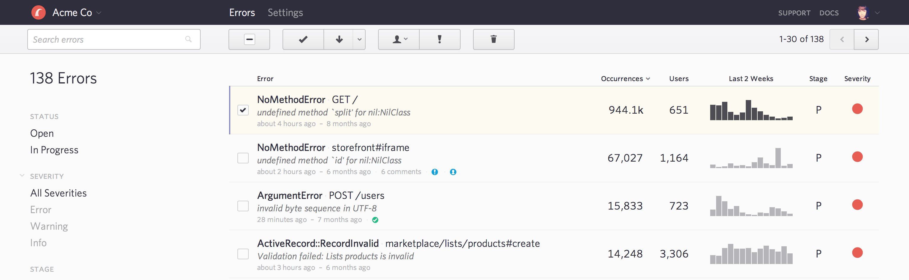

class: center, middle

# Taskqueues go wild
### (web apps context)


12/10/2015 - Adrien Di Pasquale

.logo[
  
]


---
class: center, middle

# Intro

---
class: middle, no-padding, white

.full[
  ]

???

- asynchronous tasks / jobs 
- I/O latency outside 
- Broker = messaging queue = redis / 0MQ / RabbitMQ 
- CRON = Clock 
- Workers often execute the same code as the App.
- usecases examples : mails / big task scale workers


---

## My taskqueue is better than yours

--

Celery, Sidekiq, Resque, MRQ, RQ ...

--
.margin-top[
- Efficiency 
- Reliability
- Visibility
]

???

- efficiency = Fast and cheap
- reliability = All jobs get executed at some point
- visibility = live monitoring / debug tools / (tracebacks)

---

## Why so many problems ?

???

- same code in very different context web != workers

--

- single-threaded languages

--

- concurrency

???

- locks on resources ...

--

- third party dependencies

???

- mails, apis  ...

---
class: middle, center

# PITFALLS

---
class: middle, center

# Check your code 

---

## Good Job !

- idempotent (*and re-entrant*)

???

- idempotent = can be safely run several times : *add example*
- re-entrant = can stop in the middle and be ran again in another process : *add example*

--
- stateless

???

- stateless = you cannot expect your models to be in the same state as they were when you enqueued. you should check for it or pass the state in the args.
--
- least args possible


---

## Thread-safe jobs

???

libraries ..

--
name: thread-ruby-bad

### Class level calls

```rb
class SomeJob < ResqueJob
  def self.perform(value)
    Util.some_opt = value
    Util.do_something
  end
end
```

???

- Classes are instanciated process-wise
- when ran in parralel, `Util.some_opt` will be the same process-wise

--
=> BAD

---
class: middle, white, no-padding

.full[
  ]

---
template: thread-ruby-bad

=> BAD

---

## Thread-safe jobs
### Class level calls

```rb
class SomeJob < ResqueJob
  def self.perform(value)
    util = Util.new(value)
    util.do_something
  end
end
```

=> GOOD

---

## Thread-safe jobs
### Mutable instance variables

```py
class SomeJob(MRQJob):
  some_list = []
  def run(self, params):
    some_list.push(params["value"])
```

???

- joke clear superiority of python (2 lines less)
- same problem
- when ran in parallel, `some_list` will be the same process-wise

--

=> BAD

---

## Thread-safe jobs
### Mutable instance variables

```py
class SomeJob(MRQJob):
  def run(self, params):
    some_list = []
    some_list.push(params["value"])
```

=> GOOD

???

---
class: center, middle

# My broker is a liar

---

## Contract breaches

- Atomicity

???

- read your broker specs / issues. or use redis.
- don't go too exoctic wild there are LOADS of very good messaging brokers out there. 

--

- All jobs lost on broker crash

???

- RAM-based dbs (redis) mean you have to backup regularly if you don’t want to loose jobs.
- do not use RAM-based broker if you can't accept losing a few jobs once in a while

--

=> Read specs + Periodic backups

---

## Jobs discarding

???

jobs not taken into account anymore, left out

--

- broker storage exceeded

???

- metadata pollution : tracebacks, args

--
- connection problems

???

- latency, DNS ..

--

=> monitor your broker

???


- HW monitoring, or alerts on your SAAS provider
- there are good SAAS redis providers out there.

---
class: center, middle

# Runtime Problems

???

things you can't detect before you run and volumes grow

--

*"it works on my machine"*

---

## Queue like a boss

???

strategies

---
class: middle, white, no-padding

.full[
  
]

???
  
  - worker with different configs  : 
  - 2gb ram + 4 threads 
  - 256mb ram + 100 threads

---
class: middle, white, no-padding

.full[
  
]

???

  - optimal config = least workers to dequeue everything in time
  
  - There is no one-size-fits-all solution for optimizing this. You'll have to iterate and find out what works best for your jobs with your specific workers. And you'll have to change it over time as you update jobs and their mean runtime evolves independently. Monitoring is king.

  - Queues named after the bit of logic they handle are *generally* a bad idea though. 
  - It's more scalable to group jobs in queues by their properties : mean runtime, acceptable dequeuing delay.

---

## <strike>Avoid</strike> Anticipate congestions

--

- Job A becomes 10x slower
- Job B keeps failing

???
  Bad day scenario
  A resource (DB, 3rd party) may be slow / unavailable. or a code update side effect.

--
- Worker can't dequeue it all

???

  => Jobs slowdowns will happen.

--

=> Be ready. monitor.


???
  => monitor so you notice it before the broker implodes / the end users get angry.

  => You need to be able to scale lots of worker quickly. and know your limits so you don't overload a resource / consume all the network.

  => auto-scaling is not going to be your solution (for the first few years at least)

  ==> rate of


---

## Workers will crash

- <s>Exceptions</s>

--
- Hardware crashes

--
- System reboots

???

- your system reboots very often, if it's poorly coded it's no different than a crash.
- heroku reboots everyday

--
- Memory leaks

???

- memory leak will grow quickly and worker will implode
- Heroku R14s are NOT monitored by error trackers

--

=> Soft shutdown + Tooling + Auto-restart

???


- handle signals, requeue jobs if you can't finish them in time.
- debugging memory leaks is hard. it's even harder in taskqueue systems. know your tools. roll up your sleeves.

  

---

## CRON will crash

--

- Syntax errors

???

- Syntax errors can go undetected : clock is rarely ran in development and even less covered by tests.

--
- Runtime errors

???

- Runtime error e.g. : argument computed on the fly fails
- can easily go undetected as we often run the clock as a background process of a proper worker.
--

=> KISS + monitor status and effect

???

- keep it as simple as possible. queue tasks with args
- if classical worker : all the above reasons
- status : (ping it)
- effect : heartbeat queue

---

## Exceptions & retries

--

- Jobs **will** raise exceptions

???
can't / shouldn't cover all cases. User input, unexpected context, different environments ...
exceptions will be raised.

--
name: exceptions

=> Tracking

???

- Tracking : bugsnag. middleware that logs all Exceptions to a dedicated SAAS service that will alert you. you can then depile and create issues for each depending on their priority / urgency.
- *screenshot from MRQ ?*

---

class: white, no-padding, middle

.full[
  ]

---
template: exceptions

=> Retry strategy

???

- Different jobs may have different retry strategies.
- All I/O calls (especially HTTP) should be expected to fail as a regular behaviour.
- You should retry these jobs several times before considering them as properly failed.
- You can implement increasing retries delays to handle temporarily unavailabale resources

---

## Connections problems

--

- DB overload

???
- A worker typically hits the DB way harder than a regular web process. Try and estimate how hard before scaling your workers.

--

- connections limit outreached

???

- limits : provider limit || low ulimit

--
- slave dbs

???
Sidekiq OOTB doesn't have proper pooling for slaves :o

--

=> connection pools + know your limits

???

- Make sure your workers use connection pools, and are 'good citizens', releasing the unused ones, reconnecting on deconnections ...
- Dimension your pools according to your DB limits.

---

# Conclusion

???

- emerging field
- can't overstate how much monitoring is important

--

Monitor ! Monitor ! Monitor ! Monitor ! Monitor ! Monitor ! Monitor ! Monitor ! Monitor ! Monitor ! Monitor ! Monitor ! Monitor ! Monitor ! Monitor ! Monitor ! Monitor ! Monitor ! Monitor ! Monitor ! Monitor ! Monitor ! Monitor ! Monitor ! Monitor ! Monitor ! Monitor ! Monitor !

---
# Conclusion

Workers are cheap.

---

Online version :
[http://adipasquale.github.io/taskqueues-slides-2015](http://adipasquale.github.io/taskqueues-slides-2015)

[adipasquale on github](http://github.com/adipasquale)
